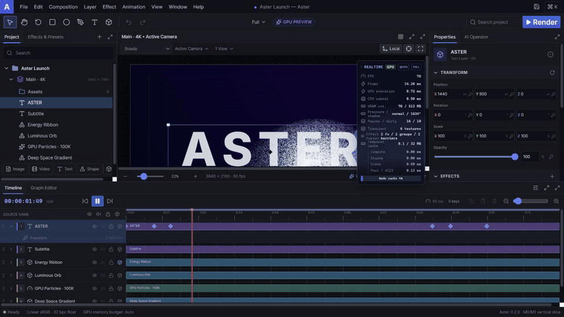

# Aster

**GPU-first motion graphics and compositing, built for real-time iteration.**

Aster is an open motion design studio built with Rust, Electron, React, and WebGPU/wgpu. Its core
model is time-addressable: project state can be evaluated at any time without replaying previous
frames. Rendering, effects, particles, and composition are designed to remain GPU-resident.

> Aster is under active development. The current vertical slice proves the editor shell, motion
> model, structured operations, project persistence, render graph, HDR WebGPU renderer, effect
> catalog, GPU particles, plugins, and an isolated Pi agent workflow.



_Live WebGPU preview: Beauty → depth fog → depth of field → normals → motion vectors._

[Watch the MP4 capture](docs/assets/aster-gpu-demo.mp4)

## Current capabilities

- AE-style desktop editor with dockable, movable, resizable panels and free viewport zoom/pan.
- Rational time, keyframes, cubic easing, graph view, layer ordering, undo/redo, and arbitrary-time
  evaluation.
- Timeline keyframes support additive multi-selection, frame-snapped group retiming, Alt-drag time
  scaling, track-aware copy/paste at the playhead, grouped deletion, and single-step undo.
- The value Graph Editor renders sampled temporal easing curves and supports frame-snapped keyframe
  time/value dragging plus direct cubic Bezier handle editing.
- Layer timing provides frame-snapped bar moves and edge trimming plus source offsets, playback
  stretch, and arbitrary-time remapping shared by videos and nested compositions.
- Arbitrary effect parameters—including numeric, color, toggle, and choice controls—support
  Inspector keyframing, distinct Timeline tracks and markers, direct retiming/removal, and GPU
  evaluation at render time.
- WebGPU high-performance adapter selection, `rgba16float` HDR composition, ACES output,
  timestamp-query profiling, absolute-time compute particles scaling from 1 to 1,000,000, and fused
  realtime effects.
- In-editor GPU benchmarks measure 1080p, 4K, 20-layer, and Blur/Glow effect-chain scenarios with
  warm-up, GPU completion barriers, median/p95/p99 reports, quick/full modes, and JSON download;
  dedicated 100K/500K/1M particle scenarios expose scaling cost on the active adapter.
- GPU image layers, time-addressable hardware-decoded video layers, recursive precompositions,
  depth-buffered 3D cubes, animated perspective/orthographic cameras, blend modes, parenting, solo,
  timing, and expressions.
- GPU-lit 3D materials carry base color, metallic, roughness, and emissive data through the HDR
  vertex path; directional, point, and spot lights expose animated transforms, HDR color, intensity,
  range, and cone controls through undoable project operations.
- A dedicated 1024² GPU shadow-map depth pass uses comparison sampling in the HDR material shader;
  its GPU time, pass count, draw calls, transient texture, and VRAM cost are reported separately.
- Bounded glTF/GLB import reads the first triangle primitive, including POSITION, NORMAL,
  TEXCOORD_0, and u8/u16/u32 indices; GLB binary chunks and embedded data-URI glTF buffers feed the
  shared PBR/shadow vertex path and remain serializable in Aster project documents.
- Particle layers provide a Trapcode-inspired, brand-independent GPU workflow with point, box,
  sphere, ring, and line emitters; vector velocity and gravity; analytic drag; turbulence; and
  HDR color, opacity, size, and rotation over life. Billboard, streak, and cube-mesh passes consume
  the same compacted GPU storage. Each slot is evaluated from absolute time and a bounded seed, so
  seeking never replays earlier frames; atomic visibility compaction intentionally leaves draw order
  unspecified while additive color remains GPU-resident.
- Vector shape layers use analytic anti-aliased WGSL signed-distance rendering for rectangles,
  rounded rectangles, ellipses, and round-capped line segments, with HDR fill/stroke colors and
  editable stroke width.
- Retained GPU text textures now come from a serializable typography model with font fallback,
  size/weight, multiline leading, left/center/right alignment, tracking, fill, and outline stroke;
  cache keys include every typography field so unchanged glyph textures remain resident.
- The searchable Asset Browser imports bounded image and video files, shows source resolution and
  duration, and locates the corresponding composition layer.
- Retained GPU text textures participate in HDR layer effects, blend modes, precompositions, and
  lossless frame export.
- Full/Half/Quarter preview resolution, dual Active/Custom views, lossless 4K PNG frame export,
  cancellable native PNG sequences, and silent SDR H.264 MP4 export with three bounded WebGPU
  readbacks, probed NVENC acceleration, `libx264` fallback, progress, cancellation, and atomic
  publication when FFmpeg is available.
- Data-driven catalog of 266 blur, color, channel, distort, generate, stylize, keying, time,
  transition, simulation, matte, perspective, layer-style, noise, immersive-video, and Looks effects,
  including 264 ordered GPU opcodes.
- Bounded incremental scene evaluation caches flattened layers and geometry by project revision,
  rationalized time, and preview resolution; the profiler reports real cache hits and dirty work.
- Professional channel and keying tools include Set Channels, Arithmetic, Alpha Levels, Remove
  Color Matting, Linear Color Key, Color Range, Matte Choker, and GPU Keylight.
- GPU channel utilities include alpha shifting, component-space conversion, straight-alpha solid
  composite, bounded pre/unpremultiplication, luminance mattes, Set Matte, and soft HDR clamping.
- Advanced blur and sharpening includes per-channel and compound blur, Smart Blur, CC Vector Blur,
  CC Radial Fast Blur, High Pass, Cross Blur, and thresholded edge sharpening.
- Fixed-cost detail processing adds detail-preserving upscale, interlace stabilization, Deband,
  bilateral Denoise, Clarity, Local Contrast, Smart Sharpen, and Frequency Separation views.
- GPU perspective and UV deformation includes Spherize, Optics Compensation, CC Bend It,
  CC Cylinder, CC Sphere, Mesh Warp, multi-style Warp, and shaded CC Page Turn.
- Advanced single-pass UV distortion includes Bezier Warp, CC Flo Motion, CC Griddler, CC Power
  Pin, CC Ripple Pulse, CC Slant, CC Smear, and CC Split.
- GPU Layer Styles include outer/inner glow, alpha stroke, inner shadow, Bevel & Emboss, Satin,
  Color Overlay, and Gradient Overlay with blend modes.
- Deterministic Noise & Grain includes tonal Add Grain, Dust & Scratches, Median, alpha/HLS noise,
  Remove Grain, and animated Turbulent Noise.
- Retro media stylization includes Scanlines, Tape Dropout, Head Switching, codec blocks, Film
  Damage, Gate Weave, RGB Phosphor, and a fixed-neighborhood GPU Pixel Sort.
- Advanced transitions include Clock, Grid, Jaws, HDR Light, Line, Scale, Twister, and randomized
  Card Wipe, with UV and alpha stages compiled into the same ordered GPU program.
- Procedural simulation includes Bubbles, Drizzle, Hair, Mr. Mercury metaballs, Particle Systems II,
  Pixel Polly, Scatterize, and damped Wave World.
- Immersive Video includes equirectangular sphere rotation/projection, spherical chromatic shift,
  latitude-band glitch, HDR gradients/glow, seam-aware blur, and animated fractal noise.
- Advanced stylization includes Color Halftone, Glowing Edges, Texturize, Tiles, CC Threshold,
  CC Toner, CC Plastic, and CC Blobbylize.
- Matte refinement includes hard/soft refine, feather, cleanup, edge decontamination, tinted light
  wrap, alpha bevel, and bounded erode/dilate morphology.
- Keying cleanup adds Key Cleaner, Screen/Core Matte, Despot, color Edge Extend/Blend, Spill Killer,
  and dual-sided CC Simple Wire Removal sampling.
- HDR lighting and generators include Light Rays, Spotlight, animated Light Leak, Anamorphic Flare,
  Volumetric Fog, Caustics, God Rays, and pulsing Laser.
- GPU drawing generators include Ellipse, partial quadratic Stroke, segmented Vegas edges,
  deterministic Scribble, Write-on, Eyedropper Fill, and bounded Paint Bucket fills.
- Exportable QC overlays include Zebra, target-gamut warnings, Focus Peaking, and alpha-boundary
  visualization; all remain sortable and maskable in the ordered GPU chain.
- Framing effects provide feathered Crop, cinematic Letterbox, rectangular/elliptical Edge Feather,
  and mirror-safe Overscan cleanup.
- Professional linear-HDR color tools include ASC CDL, per-channel Lift/Gamma/Gain, Log Wheels,
  HSL Secondary, Highlight Recovery, Gamut Compressor, False Color, and Film Print Density.
- Selective color-pipeline tools add Printer Lights, Hue-vs-Hue, Hue-vs-Saturation,
  Luma-vs-Saturation, shadow chroma control, highlight tint, filmic tone maps, and skin refinement.
- Forty one-click Looks chains with palette previews and transactional undo, complete Color Lab
  lift/pivot/gain controls, and stock-sensitive film emulation.
- Searchable Effects Browser with persistent favorites and a bounded recently-used GPU effect list.
- Persistent custom effect-chain presets capture ordered parameters, local masks, and parameter
  animation, then apply transactionally with fresh IDs and a single undo step.
- Inspector effect-chain reordering with undo; legacy grading, blur, glow, and Looks controls now
  execute as explicit ordered GPU operations instead of an out-of-band aggregate.
- Per-effect ellipse and rectangle masks run inside the ordered GPU chain for both spatial warps
  and pixel effects, with feather, opacity, inversion, undo, and project persistence.
- Bounded `.cube` import embedded in the project, uploaded as `rgba16float` 3D textures, with
  trilinear and tetrahedral GPU interpolation.
- Rust render graph with validation, topological scheduling, resource lifetimes, transient aliasing,
  and DOT/JSON diagnostics.
- The Rust renderer provides budgeted descriptor-matched GPU resource pooling, LRU shader/pipeline/
  bind-group object caches, lease diagnostics, VRAM estimates, and oldest-idle eviction.
- Open project bundle, a native WGSL plugin manager with safe mode, and an isolated Pi agent that
  stages typed, revision-checked operations through an OpenAI-compatible provider boundary.
- Browser compatibility renderer when WebGPU is unavailable.

## Architecture

```text
Sandboxed React/Electron renderer ── structured operations ── aster-core / aster-timeline
       │
       ├── WebGPU preview ───────────────────────── HDR graph/effects ── aster-render
       ├── revisioned AI service ⇄ Electron Pi utility ── model provider
       └── preload + allowlisted IPC ── desktop bridge
                                          ├── project bundle ───────── aster-project
                                          └── plugin manifests ─────── aster-plugin
```

See [Architecture](docs/ARCHITECTURE.md), [Project Format](docs/PROJECT_FORMAT.md),
[Plugin Model](docs/PLUGINS.md), [AI Operations](docs/AI_OPERATIONS.md), and the
[Pi Agent Integration](docs/PI_AGENT_INTEGRATION.md).

## Build from source

Prerequisites: Node.js 22+, pnpm 10.15, and Rust 1.97. Linux packaging additionally requires the
standard AppImage and Debian packaging tools available on the supported CI image.

```bash
pnpm install --frozen-lockfile
pnpm check:frontend
cargo test --workspace --all-features
pnpm dev
```

For the browser editor only, run `pnpm dev:web`. Production assets and the Rust desktop bridge are
built with `pnpm build`; a platform installer is produced with `pnpm artifact:build`.
Desktop bundle commands, CI artifact targets, and the MVP feature-flag policy are documented in
[Desktop Builds and Feature Flags](docs/BUILD_AND_FEATURES.md).
Updater, crash-reporting, plugin trust, and public stability criteria are defined in the
[Distribution and Trust Policy](docs/DISTRIBUTION.md).
New contributors can start from the bounded [Good First Issues](docs/GOOD_FIRST_ISSUES.md); attribution
and release credit follow the [Contributor Recognition Policy](docs/CONTRIBUTOR_RECOGNITION.md).

## Quality gates

- `pnpm check` runs Biome, TypeScript, Vitest, rustfmt, Clippy with warnings denied, and Rust tests.
- lefthook applies the relevant gates before commits and pushes.
- `cargo deny check` enforces dependency source and license policy.
- Commits use gitmoji plus Conventional Commit intent, for example
  `✨ feat: add HDR effect fusion`.

## Security and privacy

AI changes use typed staged operations. Review and Agent modes require explicit acceptance; an
explicitly activated Full Access grant may commit without per-action approval. Provider keys remain
in memory or environment variables and are never stored in project files. Embedded media is bounded
by import limits; do not open untrusted projects without reviewing their origin. See
[SECURITY.md](SECURITY.md).

## License

Aster is licensed under [MPL-2.0](LICENSE). Dependencies retain their respective licenses; see
[THIRD_PARTY_LICENSES.md](THIRD_PARTY_LICENSES.md).
