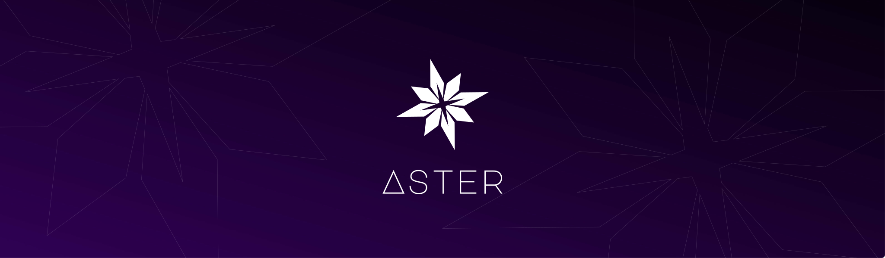

<p align="center">
  
</p>

<p align="center">
  <a href="https://github.com/colasama/Aster/actions/workflows/ci.yml"></a>
  <a href="https://github.com/colasama/Aster/actions/workflows/build-artifacts.yml"></a>
  <a href="LICENSE"></a>
  <a href="docs/DISTRIBUTION.md"></a>
</p>

<p align="center">
  <a href="Cargo.toml"></a>
  <a href="tsconfig.json"></a>
  <a href="docs/BUILD_AND_FEATURES.md"></a>
  <a href="docs/ARCHITECTURE.md"></a>
  <a href="docs/AUTOMATION.md"></a>
</p>

<div style="text-align: center; margin-bottom: 24px">Aster is an AI-native & GPU-first motion graphics and compositing editor.</div>

<p align="center">
  
</p>

> [!WARNING]
> Aster is under heavy development and is not yet production-ready. Expect breaking changes,
> incomplete features, and rough edges.

## Getting Started

Install Git, Node.js 22, pnpm 10.15.0, and Rust 1.97.1 through rustup, including the native
C/C++ build tools required by Rust on your platform. The Rust toolchain is pinned in
[rust-toolchain.toml](rust-toolchain.toml).

```bash
git clone https://github.com/colasama/Aster.git
cd Aster
pnpm install --frozen-lockfile
pnpm dev
```

The first launch compiles the Rust desktop bridge and Electron bundle, then opens the editor.
Use a WebGPU-capable GPU and current graphics drivers for GPU rendering.

MP4 export and reference-media analysis require FFmpeg and FFprobe. Make them available on
`PATH`, or set `ASTER_FFMPEG_PATH` and `ASTER_FFPROBE_PATH` before starting Aster.

## Connect Your AI

### Connect an external AI through MCP

1. Start the Aster desktop editor.
2. Open **Preferences → MCP**, enable MCP, and select **Copy client configuration**.
3. Add the copied server entry to your AI client's MCP settings, using that client's configuration
   format. The client must support local MCP servers over stdio.
4. Connect the client and ask: **Read the active composition and list its layers.**

Keep Aster running while using this connection. Your AI client manages its own model and credentials;
the Aster MCP connection does not require a model API key or token.

For an independent background editor, add `--background` to the server's launch arguments.
See [External Automation](docs/AUTOMATION.md) for source-checkout configuration, background sessions,
tools, and connection limits.

### Configure the built-in AI assistant

Open the desktop editor's **Aster Operator** panel and select **AI provider settings**.
Use an OpenAI-compatible Chat Completions service and a model that supports tool calling.

| Setting | Value |
| --- | --- |
| Endpoint | Your provider's API base URL, such as `https://provider.example/v1`. |
| Model | The exact model ID supplied by your provider. |
| API key | Your provider key, or leave empty to use `ASTER_AI_API_KEY` from Aster's environment. |
| Image input | Enable only when the selected model supports images. |
| Access mode | Start with **Review** to inspect proposed edits before accepting them. |

Remote endpoints must use HTTPS; local endpoints may use HTTP on `localhost` or a loopback address.
Try **Make the title spring in** with a text layer selected, then review and accept the proposed edits.

Keys entered in the panel stay in memory and are never stored in project files. Prompts, project
context, and requested previews may be sent to your configured provider. **Review** and **Agent**
modes require acceptance before applying edits; **Full Access** requires explicit activation and can
act without per-action approval. See [AI Operations](docs/AI_OPERATIONS.md) and [Security](SECURITY.md).

## Development

| Command | Purpose |
| --- | --- |
| `pnpm dev` | Start the complete desktop development environment. |
| `pnpm dev:web` | Start the browser editor without native desktop services or the Pi agent. |
| `pnpm check` | Run Biome, type checks, frontend and packaging tests, rustfmt, Clippy, and Rust tests. |
| `pnpm format` | Format frontend and Rust code. |
| `pnpm build` | Build production assets, the Electron bundle, and the Rust desktop bridge. |
| `pnpm artifact:build` | Build a platform installer using FFmpeg and FFprobe from your environment. |

Read [Architecture](docs/ARCHITECTURE.md) for the project layout and
[Desktop Builds](docs/BUILD_AND_FEATURES.md) for packaging and platform requirements.

## Contributing

1. Pick a [good first task](docs/GOOD_FIRST_ISSUES.md), report a bug, or discuss a larger change in
   [Issues](https://github.com/colasama/Aster/issues).
2. Fork the repository, create a focused branch, and set up the development environment above.
   Run `pnpm prepare` to install the lefthook Git hooks.
3. Make your changes, add relevant tests, and update affected documentation. Include before/after
   performance measurements for GPU or other hot-path changes.
4. Run `pnpm check`, `pnpm build`, and any relevant GPU or native smoke tests.
5. Use a gitmoji commit, such as `🐛 fix: preserve keyframe timing`, and open a pull request with
   the change's purpose and validation results.

Lefthook runs checks before commits and pushes. Rust changes must pass `cargo fmt` and Clippy with
warnings treated as errors. Project format and plugin ABI changes need compatibility or migration
consideration.

Follow the [Contributing Guide](CONTRIBUTING.md), [Pull Request Template](.github/PULL_REQUEST_TEMPLATE.md),
and [Code of Conduct](CODE_OF_CONDUCT.md).

## License

Aster is licensed under [MPL-2.0](LICENSE). Dependencies retain their respective licenses; see
[Third-Party Licenses](THIRD_PARTY_LICENSES.md).
